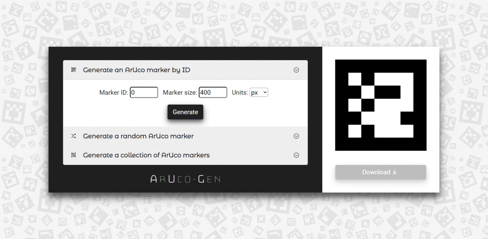
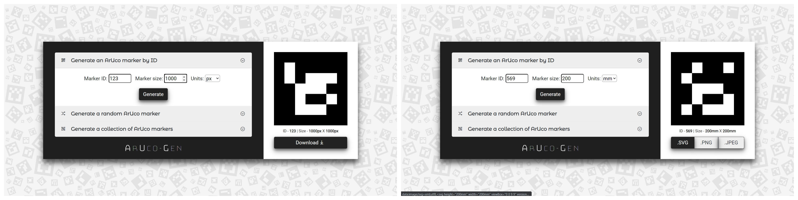
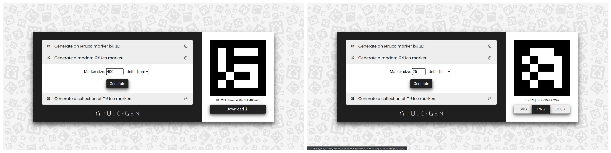
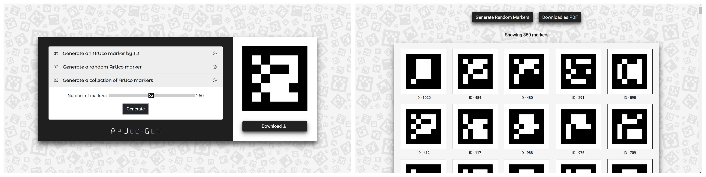

# ArUco-Gen

A powerful ArUco marker generator for creating fiducial markers with fixed and random IDs. It can even generate upto 500 markers all at once!
---
[](https://aruco-gen.netlify.app/)

Check out the **ArUco-Gen** website here -> [https://aruco-gen.netlify.app/](https://aruco-gen.netlify.app/)

---

### Features
Built using Bootstrap and JavaScript (with jQuery on top), ArUco-Gen offers the following features -
* #### Generate markers with custom IDs



* #### Generate markers with random IDs



* #### Generate a bunch of markers at a time (as many as 500!)



The binary marker matrix has been generated with the help of code derived from the aruco-marker JavaScript library. You can find the project here -> [aruco-marker](https://github.com/bhollis/aruco-marker).

---
### Using ArUco-Gen

From the command line, execute the following:

```bash
# Clone this repository
$ git clone https://github.com/Soumik-Dhar/ArUco-Gen.git/
```
```bash
# Go into the repository
$ cd ArUco-Gen/
```
```bash
# Launch index.html on your browser
$ start index.html # On Windows
$ open index.html # On Linux/Mac
```
Generate some ArUco markers by visiting the website here -> [ArUco-Gen](https://aruco-gen.netlify.app/)

---
### License
>You can check out the full license [here](LICENSE.md)

This project is licensed under the terms of the **MIT** license.
